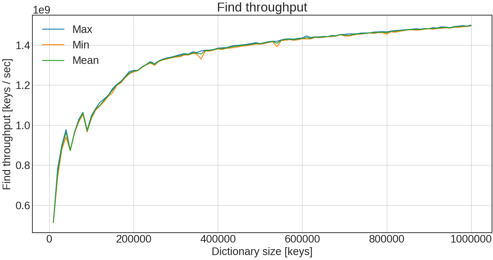
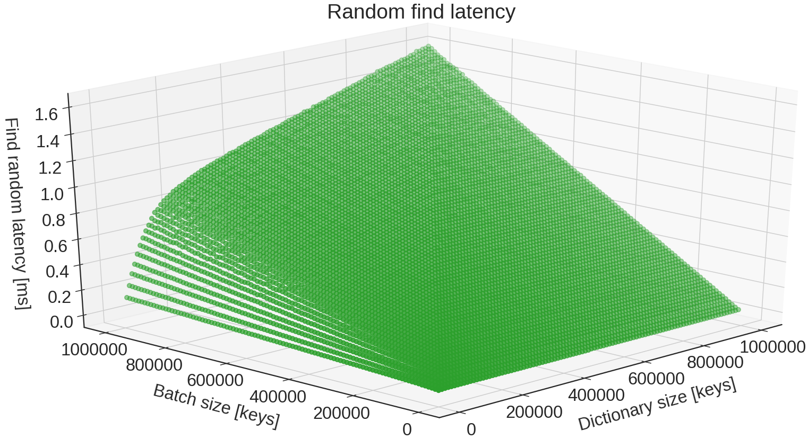
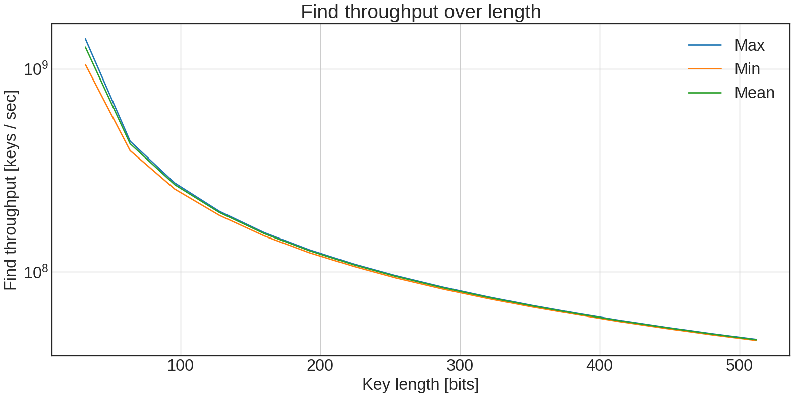
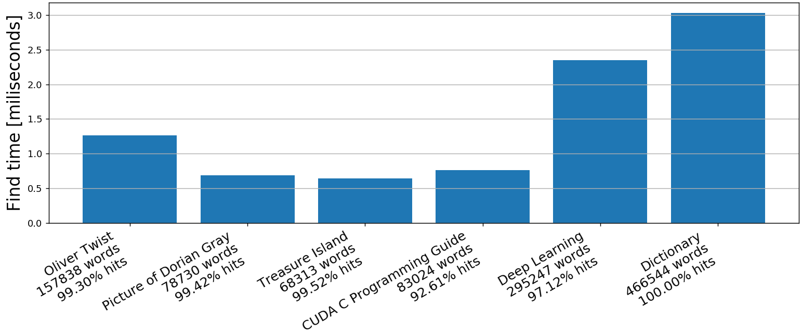

## Benchmarks

Flavors includes benchmarking utility, so you can test it yourself. Benchmarks to be performed are defined in human-friendly form in json file. Each run produces .csv file with multiple values measured during the test. For some benchmarks it also creates *dataInfo* files. They contain more precise information about data and are used to research models to pick best configurations.

To run benchmark you simply go:

```sh
./bin/flavors-benchmarks benchmark_definition.json
```
Examples of definitions files can be found [here](https://github.com/wazka/flavors/tree/dev/benchmark/definitions)

Results presented below come from GTX 1080.

### Keys benchmark

Each test follows below steps:

1. For each *count* and *seed* pair:
   1. Generate random data based on *count* and *seed*
   2. Collect *dataInfo* on generated keys.
   3. For each *configuration*: 
      1. Build tree from keys using *configuration*
      2. Find all keys, from which tree was generated.
      3. Optionally, for each *randomCount* do:
         1. Generate random keys, based on *randomCount* and *seed*.
         2. Find random keys in the tree.

#### Results

Firstly, this is plot of build throughput over dictionary size:


* Max shows biggest single value, so one configuration on one particular dictionary.
* Min shows the opposite, so the single smallest value for dictionary size.
* Mean plots performance of on average best configuration on all dictionaries.

This is plot of find throughput, so finding in tree all the keys from which it is made of (in other words with hit rate equal to 1):



Finally, this is plot of latency of finding random keys in batches of different sizes:




### Keys lenght benchmark

This benchmark let's you see, how Flavors performs for different lenghts of keys.
 
#### Results

Here we have build and find throughputs for different lengths of keys:




### Dictionary benchmark

This tests builds tree from dictionary of English words (around 450,000 words) and finds all words from different books in it.

#### Results

Below you will find corresponding results:



