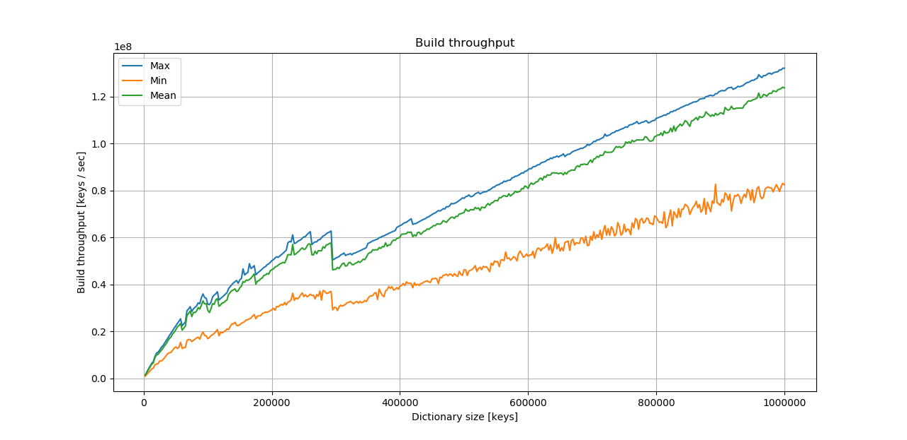
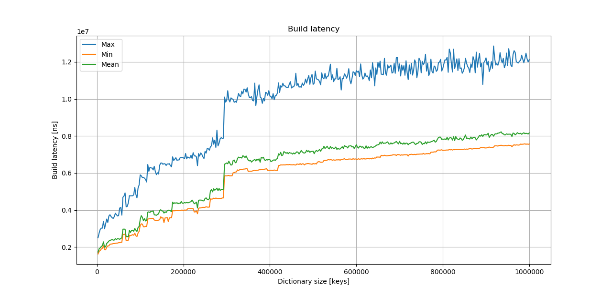
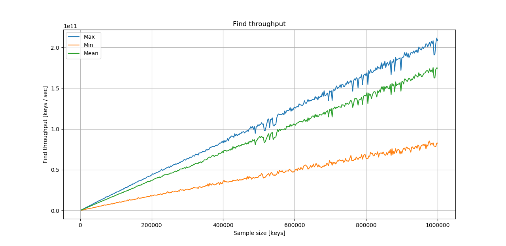
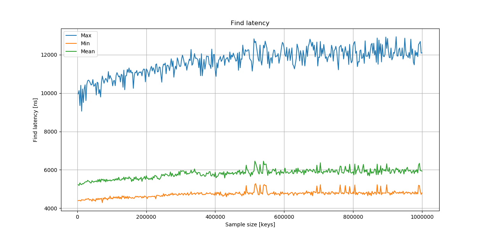

## Benchmarks

Flavors includes benchmarking utility, so you can test it yourself. Benchmarks to be performed are defined in human-friendly form in json file. Each run produces .csv file with multiple values measured during the test. For some benchmarks it also creates *dataInfo* files. They contain precise information about data and are used to research models to pick best configurations.

To run benchmark you simply go:

```sh
.\flavors-benchmarks benchmark_definition.json
```
Examples of definition files can be found [here](https://github.com/wazka/flavors/tree/dev/benchmark/definitions)

#### Keys benchmark

Each test follows below steps:

1. For each *count* and *seed* pair:
   1. Generate random data based on *count* and *seed*
   2. Collect *dataInfo* on generated keys.
   3. For each *configuration*: 
      1. Build tree from keys using *configuration*
      2. Find all keys, from which tree was generated.
      3. Optionally, for each *randomCount* do:
         1. Generate random keys, based on *randomCount* and *seed*.
         2. Find random keys in the tree.
 

## Results

Here you can find some experimental results obtained by running flavors benchmarks.

#### Keys benchmark

Results presented below come from Tesla P100 GPU.

In this case, for each configuration and dictionary size, test was performed 300 times for different random seeds. Test was performed for 145 configurations. They were picked as best in at least one case (*count* and *sead* pair) in previous tests.

Firstly, this is plot of build throughput over dictionary size:



* Max shows biggest single value, so one configuration on one particular dictionary.
* Min shows the opposite, so the single smallest value for dictionary size.
* Mean plots performance of on average best configuration on all dictionaries.

For the full picture, here are corresponding latencies:

 

This are plots of find times, so finding in tree all the keys from which it is made of (in other words with hit rate equal to 1):






